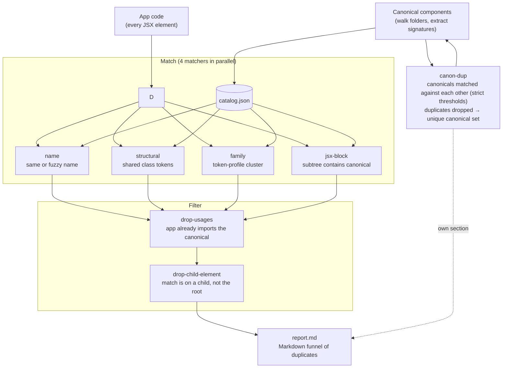

# @md-code/component-uniqueness

ESLint rule + CLI scanner that finds **duplicate components** in your app code by comparing them against your canonical component library. Cross-framework: React today, the same signature model is designed to carry over to Vue and Angular.

## How it works



## Quick start

```sh
bun add -D @md-code/component-uniqueness
```

```js
// eslint.config.js
const uniqueness = require("@md-code/component-uniqueness/plugin");

module.exports = [
  {
    files: ["**/*.tsx"],
    plugins: { "md-code": uniqueness },
    rules: {
      "md-code/component-uniqueness": ["error", {
        componentsFolder: [
          { path: "core/ui/atoms", rank: 0 },
          { path: "core/ui/formation", rank: 1 },
          { path: "core/ui/partials", rank: 2 },
        ],
        catalogPath: "reports/component-catalog.json",
      }],
    },
  },
];
```

The catalog is generated automatically on the first lint when the file is
missing (from the `componentsFolder` option) — it is gitignored and never
committed. You can also generate it explicitly:

```sh
bunx md-code-component-uniqueness
```

Run the linter as usual:

```sh
bunx eslint "src/**/*.tsx"
```

## CLI

```sh
bunx md-code-component-uniqueness [flags]
```

| Flag | Description |
| --- | --- |
| `--roots a:b` | Scan roots (overrides `componentsFolder` from config) |
| `--out <file>` | Catalog output path (default `reports/component-catalog.json`) |
| `--check` | CI gate — exit 1 if catalog is stale |
| `--report [file]` | Write a Markdown duplicate report |
| `--verbose` | Include the "Filtered out" section in the report |
| `--app-roots a:b` | App-code roots for the report (default: repo root) |
| `--repo-root <dir>` | Repo root (default: auto-discovered) |

## What it flags

| Tier | Meaning |
| --- | --- |
| `name` | App component has the same name as a canonical one |
| `name-fuzzy` | Name is a fuzzy match (e.g. `MyButton` vs `Button`) |
| `structural-exact` | ≥ 80% of the canonical's distinctive class tokens are shared |
| `structural-similar` | 40–80% shared |
| `family` | Clusters by token profile (hand-built library pieces) |
| `jsx-block` | A JSX subtree in app code contains the full tag-sequence of a canonical component |

## What the ESLint rule reports

| messageId | Fires when |
| --- | --- |
| `duplicateComponent` | A canonical component name is declared outside its registry directory |
| `rawHtml` | A raw interactive element (`button`, `input`, `select`, …) is used outside the canonical packages — the element's behavior (its `type`, `role`, `aria-*`) maps to a canonical component |
| `layoutPrimitive` | A hand-rolled element **behaves like** a canonical component: its behavioral signals (event handlers + behavioral `role`/`type`/`aria-*` tokens) are a subset of a canonical's. Derived entirely from the catalog — no hardcoded role/behavior lists |
| `styledInApp` | A `styled.*` component is created outside the canonical packages |
| `catalogDuplicate` | An element structurally duplicates a canonical one (shared a11y token, or ≥ 3 shared layout style keys with high similarity) — error level |
| `similarComponent` | Same as above but below the error threshold — warning level |

The behavioral check (`layoutPrimitive`) runs only outside the canonical
folders — inside them, the canonical's own body is the source of truth. It
keys off the **lowest-rank** canonical whose signal set contains the
candidate's, so the most basic canonical wins.

## Options (rule config)

| Option | Default | Notes |
| --- | --- | --- |
| `componentsFolder` | `[]` | Canonical dirs. `{ path, rank }` objects or plain strings. Rank drives the behavioral check (lowest = most basic) |
| `catalog` / `catalogPath` | — / `reports/component-catalog.json` | Inline catalog object, or path to load one |
| `registry` / `registryPath` | — / `reports/component-registry.json` | Canonical name → allowed dirs, for `duplicateComponent` |
| `includeDynamic` | `false` | Also load a dynamic (DOM-snapshot) catalog |
| `dynamicCatalog` / `dynamicCatalogPath` | — | Inline / path for the dynamic catalog |
| `tsconfig` | — | Fallback `tsconfig.json` (or any `.ts` file next to one) used to resolve imports when the file has no `tsconfig` of its own. Resolution is done by TypeScript; unresolved imports keep their component name |
| `rawHtml` | `false` | Match every HTML element that carries behavior (an event handler, `role`/`aria-*`, or an interactive tag) against the canonical catalog with the same matchers and decision-maker as components. The best canonical at or above the duplicate threshold is suggested |
| `exclude` | `*.stories.*`, `*.test.*`, `*.spec.*`, `*.d.ts`, `**/__tests__/**` | Globs, `^...$` regexes or `/.../ ` regexes to skip |
| `include` | `[]` | If set, only matching files are linted |
| `exts` | `.tsx`, `.ts`, `.jsx`, `.js` | File extensions to scan |
| `ignoreDirs` | `node_modules`, `dist`, `build` | Directory names to skip while walking |
| `rootMarkers` | `.git` | File names that mark the repo root (auto-discovery) |
| `debt` | `{}` | Known-duplicate ledger (shrink-only) |

## Notes

- The catalog is **generated on demand** by the rule when the file is missing
  (same code path as the CLI), so it can stay gitignored and CI works out of
  the box. The CLI is still useful for `--report` and `--check`.
- The catalog is read once per ESLint process and cached.
- A missing or stale catalog logs a warning; lint never crashes.
- Everything is plain Node + `fs`/`path` — works identically on Linux, macOS, Windows.
