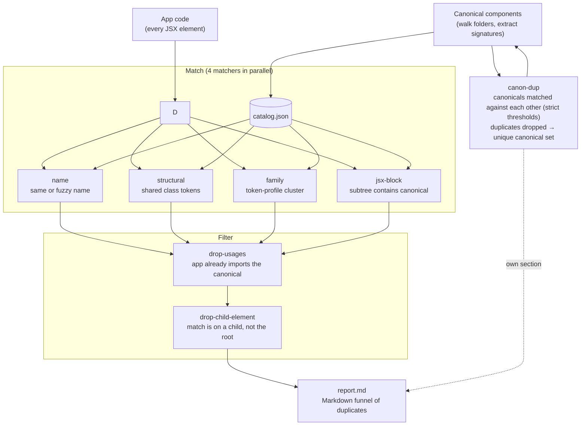

# @md-code/react-component-uniqueness

ESLint rule + CLI scanner that finds **duplicate React components** in your app code by comparing them against your canonical component library.

## How it works



## Quick start

```sh
bun add -D @md-code/react-component-uniqueness
```

```js
// eslint.config.js
const uniqueness = require("@md-code/react-component-uniqueness/plugin");

module.exports = [
  {
    files: ["**/*.tsx"],
    plugins: { "md-code": uniqueness },
    rules: {
      "md-code/react-component-uniqueness": ["error", {
        componentsFolder: [
          { path: "core/ui/atoms", rank: 0 },
          { path: "core/ui/formation", rank: 1 },
          { path: "core/ui/partials", rank: 2 },
        ],
        catalogPath: "reports/component-catalog.json",
      }],
    },
  },
];
```

The catalog is generated automatically on the first lint when the file is
missing (from the `componentsFolder` option) — it is gitignored and never
committed. You can also generate it explicitly:

```sh
bunx md-code-react-component-uniqueness
```

Run the linter as usual:

```sh
bunx eslint "src/**/*.tsx"
```

## CLI

```sh
bunx md-code-react-component-uniqueness [flags]
```

| Flag | Description |
| --- | --- |
| `--roots a:b` | Scan roots (overrides `componentsFolder` from config) |
| `--out <file>` | Catalog output path (default `reports/component-catalog.json`) |
| `--check` | CI gate — exit 1 if catalog is stale |
| `--report [file]` | Write a Markdown duplicate report |
| `--verbose` | Include the "Filtered out" section in the report |
| `--app-roots a:b` | App-code roots for the report (default: repo root) |
| `--repo-root <dir>` | Repo root (default: auto-discovered) |

## What it flags

| Tier | Meaning |
| --- | --- |
| `name` | App component has the same name as a canonical one |
| `name-fuzzy` | Name is a fuzzy match (e.g. `MyButton` vs `Button`) |
| `structural-exact` | ≥ 80% of the canonical's distinctive class tokens are shared |
| `structural-similar` | 40–80% shared |
| `family` | Clusters by token profile (hand-built library pieces) |
| `jsx-block` | A JSX subtree in app code contains the full tag-sequence of a canonical component |

## Options (rule config)

| Option | Default | Notes |
| --- | --- | --- |
| `componentsFolder` | `[]` | Canonical dirs. `{ path, rank }` objects or plain strings |
| `catalogPath` | `reports/component-catalog.json` | Where the catalog lives |
| `thresholds` | built-in | `minShared`, `minRatioSameTag`, `minRatioAnyTag`, `exactRatio`, `familyMatchMin` |
| `exclude` | `node_modules, dist, build, .git` | Globs or regexes to skip |
| `include` | `[]` | If set, only matching files are linted |

## Notes

- The catalog is **generated on demand** by the rule when the file is missing
  (same code path as the CLI), so it can stay gitignored and CI works out of
  the box. The CLI is still useful for `--report` and `--check`.
- The catalog is read once per ESLint process and cached.
- A missing or stale catalog logs a warning; lint never crashes.
- Everything is plain Node + `fs`/`path` — works identically on Linux, macOS, Windows.
