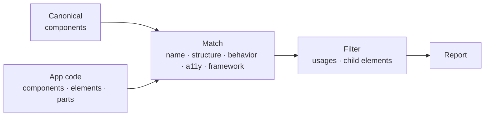

# @md-code/component-uniqueness

ESLint rule and CLI that find components, raw HTML and copied JSX blocks that duplicate a component you already have in your design system.



Structure is compared as rendered HTML with the CSS your classes resolve to, so two differently written components with the same markup and styles match.

## Quick start

```sh
bun add -D @md-code/component-uniqueness
```

```js
// eslint.config.js
const plugin = require("@md-code/component-uniqueness/plugin");

module.exports = [
  {
    files: ["src/**/*.{ts,tsx}"],
    plugins: { "md-code": plugin },
    rules: {
      "md-code/duplicate-component": ["error", {
        componentsFolder: ["src/ui/atoms", "src/ui/formation", "src/ui/partials"],
        tsconfig: "src/ui/tsconfig.json",
        rawHtml: true,
        parts: true,
      }],
    },
  },
];
```

Generate the catalog once before linting, and again when the canonical components change. It is read from `reports/component-catalog.json` and should be gitignored.

```sh
bunx component-uniqueness
```

## Layers

`componentsFolder` is ordered: each folder is built from the ones before it. A file inside a folder is compared only with the folders to its left, so `formation` is checked against `atoms`, and `partials` against both. The first folder is the base and is not compared with anything. Files outside all of them are compared with every folder.

## What it reports

| messageId | Fires when |
| --- | --- |
| `duplicateComponent` | A component duplicates a canonical one |
| `rawHtml` | A raw element (`button`, `input`, `a`, …) should be a canonical component. Needs `rawHtml: true`. Not applied inside `componentsFolder` |
| `partOfComponent` | A block inside a component duplicates a canonical one. Needs `parts: true` |

A component that already renders the canonical one is a usage, not a duplicate, and is skipped.

## Options

| Option | Default | Notes |
| --- | --- | --- |
| `componentsFolder` | `[]` | Canonical folders, lowest layer first |
| `tsconfig` | — | Used to resolve imports when a file has no `tsconfig` of its own |
| `rawHtml` | `false` | Also check raw elements |
| `parts` | `false` | Also check blocks inside components |
| `catalogPath` | `reports/component-catalog.json` | Where the catalog is read and written |
| `include` | `[]` | Lint only matching files. Files inside `componentsFolder` are always linted |
| `exclude` | stories, tests, `*.d.ts` | Globs to skip |
| `ignoreDirs` | `node_modules`, `dist`, `build` | Added to the defaults |
| `exts` | `.tsx` `.ts` `.jsx` `.js` | File extensions |
| `weights` | name 0.10, structure 0.5, behavior 0.2, a11y 0.1, framework 0.15 | Signal weights |
| `thresholds` | duplicate 0.6, similar 0.4 | Confidence cut-offs |

## CLI

```sh
bunx component-uniqueness [flags]
```

Options are read from the rule in `eslint.config.js`.

| Flag | Description |
| --- | --- |
| `--report [file]` | Write a Markdown report of every finding |
| `--check` | Exit 1 if the catalog is stale |
| `--roots a:b` | Canonical folders, instead of `componentsFolder` |
| `--app-roots a:b` | Folders to scan for the report (default: repo root) |
| `--repo-root <dir>` | Repo root (default: auto-detected) |
| `--out <file>` | Catalog path |
| `--verbose` | Also list what the filters dropped |
