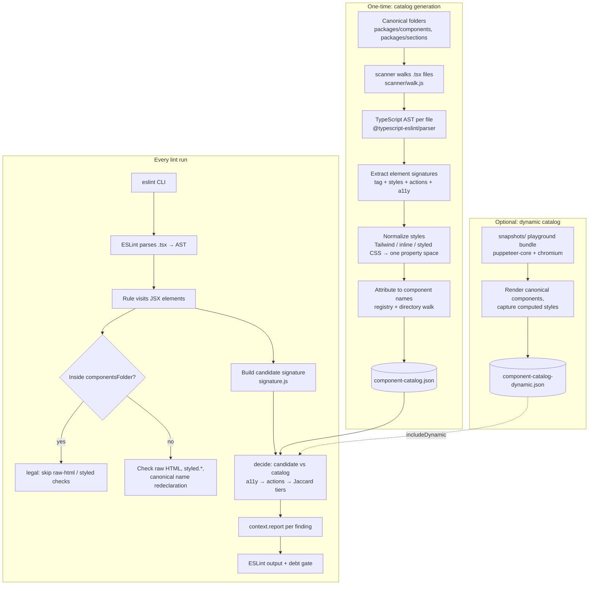

# react-component-uniqueness

An ESLint rule that enforces **one component = one canonical location** in a
React monorepo. It ships as a plain npm dependency and works with the standard
`eslint` CLI — no custom runner, no fork of ESLint.

The rule has two data files (a **registry** and a **signature catalog**) that
describe your canonical component packages, and a bundled **scanner** that
generates the catalog from your source tree. Everything is plain Node +
`path`/`fs` — no `child_process`, no platform-specific code; it lints
identically on Linux, macOS and Windows.

## What it finds

| Error type | messageId | What it catches |
| --- | --- | --- |
| Component duplicate (name) | `duplicateComponent` | A canonical component **name** (from the registry) being declared outside its canonical directory — e.g. a second `Button` in app code. |
| Raw HTML in app code | `rawHtml` | Raw interactive/form elements (`button`, `input`, `select`, `textarea`, `form`, `label`, `table`, `dialog`) used outside the canonical packages. |
| `styled.*` in app code | `styledInApp` | `styled.div` / `styled("button")` / `styled.button` created outside the canonical packages. |
| Signature duplicate | `catalogDuplicate` | An element whose normalized **signature** matches a canonical component at the error tier (see below). |
| Similar to a component | `similarComponent` | A warning-tier catalog match — report-only, never fails a debt gate. |

## What it does NOT find

- **Behavior-only hand-rolled components.** The `layoutPrimitive` error type
  ("a `div` that *behaves* like a Button/Modal/Card") exists in the codebase
  but is **disabled by default** — on a large codebase it produced hundreds of
  false positives. Signature matching (styles + actions + a11y) is the
  replacement: it needs concrete shared signals, not just "div with onClick".
- **Pure structural/visual clones with no shared signals.** If two elements
  share fewer than 3 CSS properties and no a11y/action overlap, no similarity
  tier fires — that is intentional, to keep the warning band meaningful.
- **Styles injected by UI libraries at runtime** (MUI `sx`, antd cssinjs)
  unless you generate the optional **dynamic catalog** (see below) and enable
  `includeDynamic`.
- **Files filtered out by `include` / `exclude`**, and anything inside
  `componentsFolder` (that is the canonical building material — raw HTML and
  `styled.*` are legal there by definition).

## Install

```sh
npm install react-component-uniqueness
# or: pnpm add -D react-component-uniqueness
```

Peer dependencies: `eslint >= 8.40.0`, `typescript >= 4.7.0`.

## Usage (flat config)

```js
// eslint.config.js
const componentUniqueness = require("react-component-uniqueness/plugin");

module.exports = [
  {
    files: ["**/*.tsx"],
    plugins: { md: componentUniqueness },
    rules: {
      "md/react-component-uniqueness": [
        "error",
        {
          registryPath: "reports/component-registry.json",
          catalogPath: "reports/component-catalog.json",
          componentsFolder: ["packages/components/", "packages/sections/"],
        },
      ],
    },
  },
];
```

Then run the plain CLI as usual: `npx eslint "src/**/*.tsx"`.

### Options

| Option | Type | Default |
| --- | --- | --- |
| `registry` | object | — (inline registry; takes precedence over `registryPath`) |
| `registryPath` | string | `reports/component-registry.json` |
| `catalog` | object | — (inline catalog) |
| `catalogPath` | string | `reports/component-catalog.json` |
| `includeDynamic` | boolean | `false` — also match against the rendered-DOM (dynamic) catalog |
| `dynamicCatalogPath` | string | `reports/component-catalog-dynamic.json` |
| `rawElements` | string[] | `button, label, select, textarea, input, form, table, dialog` |
| `behaviorTags` | string[] | `div, main, section, header, footer, nav, aside, span, ul, li, a, p, figure, img` |
| `componentsFolder` | string[] | `[]` — the canonical component directories (raw HTML / `styled.*` are legal inside) |
| `include` | (string\|RegExp)[] | `[]` (empty = lint everything not excluded) |
| `exclude` | (string\|RegExp)[] | `**/node_modules/**, **/dist/**, **/build/**, .git/**` |
| `debt` | object | — (shrink-only ledger: `"relpath::ruleId"` → allowed count) |

All paths are repo-relative (the repo root is discovered by walking up for
`pnpm-workspace.yaml`) or absolute. `include`/`exclude` entries are minimatch
globs (`"packages/apps/**"`) or regexes (`"^packages/apps/"`); `exclude`
always wins; a non-empty `include` means only matching files are linted.

### The two data files

- **Registry** (`reports/component-registry.json`) — canonical component
  **names** and the directories where each name may be declared. Powers
  `duplicateComponent`, and is used by the scanner for name attribution.
- **Catalog** (`reports/component-catalog.json`) — the **signature catalog**:
  one entry per distinct element inside the canonical packages, normalized to
  `{ tag, styles, actions, a11y }`. Tailwind classes, inline
  `style={{...}}` and `styled` CSS all collapse into the same CSS-property
  space, so `flex gap-4`, `{ display: "flex", gap: "1rem" }` and
  `"display: flex; gap: 1rem;"` are the same signature. Generated by the
  bundled scanner. Powers `catalogDuplicate` / `similarComponent`.

### Similarity: the decision matrix

Matching an element against the catalog is a similarity decision
(`signature.js`), not an exact comparison. In priority order:

1. **Meaningful a11y overlap** (shared `role`/`aria-*` tokens) → **error**
   (`catalogDuplicate`).
2. **Action overlap + the canonical entry is `type:button` + the entry has
   ≥ 3 styles** → **error** (a hand-rolled button duplicating the canonical
   Button).
3. **Styles-only:** shared CSS keys must be **≥ 3** or nothing fires. Then
   Jaccard similarity of the property sets:
   - ≥ 0.9 (any tag) → **error**
   - ≥ 0.7 (same tag) → **error**
   - ≥ 0.5 (different tag) → **warning** (`similarComponent`)
   - ≥ 0.4 (same tag) → **warning**

When several catalog entries match, the best one wins: error beats warning,
then higher similarity. The warning tier is report-only and is excluded from
the debt gate.

## How it works (data flow)



- The **scanner** runs once (or in CI with `--check`); it never runs during
  lint.
- The **dynamic catalog** is a one-time puppeteer snapshot, used only when
  `includeDynamic: true`.
- Both catalogs are read **once per process** and cached in memory; a missing
  file logs a warning and degrades that error type to a no-op — lint never
  crashes on a stale or absent data file.

## Catalog scanner (CLI)

```sh
npx react-component-uniqueness            # regenerate reports/component-catalog.json
npx react-component-uniqueness --check    # CI gate: exit 1 when the catalog is stale
npx react-component-uniqueness --report   # also write ./component-duplicates.md
npx react-component-uniqueness --report reports/duplicates.md
```

| Flag | Default |
| --- | --- |
| `--roots a:b` | `packages/components:packages/sections` |
| `--out <file>` | `reports/component-catalog.json` |
| `--registry <file>` | `reports/component-registry.json` |
| `--repo-root <dir>` | discovered automatically |
| `--check` | off — exit 1 when the catalog would change (CI gate) |
| `--report [file]` | off — write a Markdown duplicate report (default `./component-duplicates.md`) |

The report is plain Markdown: counts per component name split by tier
("exact" = error tier, "similar" = warning tier), a summary table, and the
tier definitions.

## Debt ledger

`debt` is a shrink-only ledger mapping `"relpath::ruleId"` → allowed finding
count. Findings within the budget are downgraded to warnings so a legacy
codebase can be gated green while the debt only ever decreases. See `debt.js`.

## Package layout

```
index.js          the ESLint rule (entry point)
plugin.js         { rules: { "react-component-uniqueness": rule } }
config.js         option normalization + default tag lists + include/exclude
signature.js      Signature model, style normalization, decision matrix
debt.js           shrink-only debt ledger (applyDebt / loadLedger)
loaders.js        cached registry/catalog JSON loading
resolve.js        string-literal resolution (cn/clsx, ternaries, imports)
dom.js            JSX attribute/signature extraction
report.js         human-readable Markdown duplicate report
errorTypes/       one file per error type (duplicate-component, raw-html,
                  layout-primitive, styled-in-app)
scanner/          catalog scanner (main / walk / extract / attribute / output)
snapshots/        one-time dynamic-catalog generator (puppeteer-core + chromium)
bin/              CLI entry point
```
