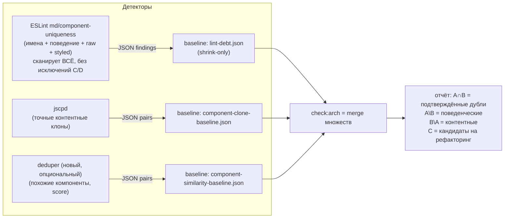

Т.е. я напоминаю, мы пришли к выводу, что архитектура следующая - 

План, без кода. Четыре части: текущая логика → что такое «канонические исключения» на самом деле → сравнение тулов → новый флоу данных по множествам.

---

## Часть 1. Текущая логика, по шагам

**Слой 1 — duplicateComponent (имена).**
1. `gen-component-registry.mjs` сканирует экспортную поверхность `packages/components` + `packages/sections` → `reports/component-registry.json` (102 имени → канонические директории).
2. ESLint-правило видит `export const Button = ...` / `export function Form()` / `export class Card` и сверяет имя с реестром. Имя из реестра объявлено вне своей директории → finding.
3. Второй экземпляр `Form` в keystone не падает, потому что в реестре у `Form` **две** директории (default + keystone) — это не «исключение», это данные реестра.

**Слой 2 — rawHtml (сырой интерактивный HTML).**
`button/input/select/textarea/form/table/dialog/label` вне `packages/components|sections` → finding. Внутри этих папок — молча.

**Слой 3 — layoutPrimitive (поведение).**
Для тегов `div/span/ul/a/...` и raw-тегов: `role=dialog`/`aria-modal`, `input type=range/checkbox/radio`, `onClick` на span, `role=menu`, spin/modal/card/flex/grid классы (в т.ч. из переменных, тернарников, `cn()`, импортов из соседних файлов), `position:fixed+zIndex` → finding «hand-rolled X».

**Слой 4 — styledInApp.**
`styled.<тег>` вне `packages/components|sections` → finding.

**jscpd** — отдельный детектор: контентные клоны (`--min-tokens 60 --min-lines 8`), фильтр «оба .tsx + JSX во фрагменте» → 11 пар в базлайне.

**Debt ledger** — `lint-debt.json`: все текущие findings ESLint-правил, shrink-only. `gen:debt` = пересоздать, `check:debt` = упасть на новые.

**check:arch** = реестр → check:debt → jscpd → `turbo lint`.

---

## Часть 2. Что такое «канонические исключения» — честный разбор

В правиле сейчас 4 места, где что-то не смотрится:

| # | Место | Что делает | Вердикт |
|---|---|---|---|
| A | Слой 2: raw HTML внутри `packages/components\|sections` | не отчитывается | **Оправдано по определению.** `<button>` внутри файла канонического Button — это *тело* компонента, не компонент. Флагнуть канонический Button за то, что он сделан из `<button>` — бессмысленный шум. Компонент ≠ разметка. |
| B | Слой 4: `styled.button` внутри `packages/components` | не отчитывается | **То же самое.** `styled.button` в папке Button — это канонический Button. |
| C | Слой 3: layout container (flex div) внутри `packages/components` | не отчитывается | **Частично оправдано.** Flex-div — это «кирпич», из которого сделан каждый канонический компонент. Но по твоей доктрине «смотреть всё, потом фильтровать» — его можно отчитывать и класть в базлайн. Решаю по твоему выбору. |
| D | Слой 3: raw-элементы внутри `packages/components` вообще не проходят behavior-чек + `inCanonicalForBehavior` (input checkbox в папке Checkbox не отчитывается) | **Вот это — легаси от неверного чтения задачи.** «input type=checkbox внутри папки Checkbox — каноническая реализация» — это я придумал, чтобы не шуметь. По твоей логике: смотреть везде, а «ожидаемые дубликаты» определять базлайном. |

Итог: A и B — не «канонический слой», а разница «компонент vs его внутренности» (без них канонический Button сам себя бы обвинял). C и D — убираются в пользу «полный скан + базлайн».

---

## Часть 3. Сравнение тулов

| Тул | Что детектит | Качество | Output | В CI-гейт |
|---|---|---|---|---|
| **ESLint-правило (моё)** | имена, поведение, raw HTML, styled | Единственный, кто ловит «span ведёт себя как кнопка» — по токенам это **недетектируемо** | JSON findings, строка-точность | ✅ уже в гейте |
| **jscpd** (уже есть) | точные/почти-точные контентные клоны | Детерминированный, быстрый; не понимает семантику; порог 8 строк | JSON/HTML, пары файлов со строками | ✅ уже в гейте |
| **deduper** | AST-сходство компонентов + CSS | Хорош на «похожие, но не идентичные» (copy-paste с переименованиями) — то, что jscpd пропускает из-за порока токенов | список пар с score | ✅ легко (CLI, JSON) |
| **duplicalis** | AI-эмбеддинги + AST, категории #prop-parameterizable / #copy-paste-variant / #forked-clone | Лучший семантически, но **нелинейный**: LLM API, стоимость, недетерминизм между прогонками | отчёты | ❌ как гейт — нет (базлайн будет «плыть»); ✅ как offline-анализ |
| **similarity-ts** | TSED по AST, очень быстрый | ≈ jscpd, быстрее на больших базах; React-специфики нет | пары | ✅, но **не даёт ничего сверх jscpd** на нашей базе |
| **react-native-reuse-finder** | Type-1/2/3 клоны + reuse-value ranking | Хорошие отчёты, но тяжёлый, заточен под RN | отчёты | ⚠️ избыточно |
| **Buoy** | component clones + style dups | Визуально удобно, SaaS-модель | веб-UI | ❌ не встраивается в pipeline |
| **fallow/archlint** | duplication + зоны | duplication — вторичная фича | — | ⚠️ уже обсуждали, не добавляет |

**Вывод по «можно ли не городить»:** да. Минимальный полный набор = **ESLint-правило (поведение/имена) + jscpd (точные клоны) + deduper (похожие, но не идентичные)**. Остальные либо дублируют jscpd (similarity-ts), либо не годятся в гейт (duplicalis, Buoy), либо избыточны (reuse-finder, fallow).

---

## Часть 4. Новый флоу данных: множественная модель

Каждый детектор — самостоятельный генератор **множества** findings со своим shrink-only базлайном. Гейт работает с объединением, а не с одним правилом.



**Свойства:**
1. **Каждое множество независимо**: можно отключить deduper, не трогая остальные; базлайны не мешают друг другу.
2. **Пересечение = уверенность**: finding, попавший и в ESLint, и в jscpd — «дубликат подтверждён двумя методами», в отчёте помечается отдельно. Это и есть «выбирать нужное из множеств».
3. **«Ожидаемые дубликаты» = базлайны.** Никаких хардкод-исключений в правилах: правило отчитывает всё, что видит; то, что считается ожидаемым (flex-div'ы внутри канонических компонентов, второй Form в keystone) — живёт в JSON-базлайнах, а не в коде правила. Базлайн = явная, ревью-бельная, shrink-only декларация.
4. **duplicalis — вне гейта**, как разовый offline-анализ для генерации гипотез (его категории #forked-clone/#prop-parameterizable хороши как чек-лист для человека, но недетерминизм ломает shrink-only).

**Конкретные изменения (после твоего одобрения):**
1. Правило: убрать D (raw-элементы внутри `packages/components` проходят behavior-чек; `inCanonicalForBehavior` удаляется) и C (layout container отчитывается везде). A и B остаются — это «тело компонента», а не компонент.
2. Прогнать пробы (4 фейла по scope-lookup ещё чинятся — это баг ESLint 9 API, не дизайна).
3. `gen:debt` — новый честный базлайн (он вырастет; это и есть декларация «ожидаемых дубликатов»).
4. deduper: поставить как третий генератор + третий базлайн + merge в `check:arch` (отдельным шагом, после того как первые два множества станут зелёными).

Да, логика верная, и я её уточню в конкретную архитектуру. По пунктам.

## 1. Тип ошибки + подсказка «как исправить»

Да. Каждый `messageId` — тип finding, и к каждому добавляется **deterministic suggestion** (не LLM, а данные из каталога):

- `rawHtml`: `<input type=range>` → «заменить на `Slider` из @md/components». Маппинг tag+attributes → имя компонента — табличная, 100% предсказуемая.
- `styledInApp`: `styled.div` + внутри `display:flex; gap` → сигнатура совпала с `Container` → «заменить на `Container`». То есть подсказка — результат того же component finder'а, а не отдельная магия.
- `layoutPrimitive`: уже получает `what` («hand-rolled modal / dialog») + добавляется имя конкретного канонического компонента из каталога.

## 2. Component finder — да, ровно так

Единый нормализованный интерфейс сигнатуры:

```
Signature = {
  tag:     "div",                    // нормализованный тег
  styles:  Set<токен>,               // единое пространство токенов
  actions: Set<string>,              // onClick, onChange, onKeyDown, ...
  a11y:    Set<string>,              // role:dialog, aria-modal, aria-expanded, ...
}
```

**Конвертация в Tag+Styles+Actions из всех источников:**

| Источник | Как конвертируется |
|---|---|
| tailwind className | токены как есть, через таблицу в CSS-пространство: `flex`→`display:flex`, `gap-4`→`gap:1rem`, `rounded-lg`→`border-radius`, `shadow`→`box-shadow`, `animate-spin`→`animation` |
| inline `style={{...}}` | property:value → тот же токен `display:flex` |
| styled-components | парсинг CSS-деклараций из тега → те же токены |
| handlers / aria | прямое копирование в `actions` / `a11y` |

После конвертации **все четыре источника живут в одном пространстве токенов** — и styled-компонент в приложении сравнивается с tailwind-div на равных. Это и есть то, чего не хватает текущему правилу (regex'ы по классам — это примитивная версия именно этого).

## 3. Каталог — расширение того же первого JSON

`gen-component-registry.mjs` уже строит «имя → директории». Добавляем второй артефакт: **behavior catalog** — для каждого канонического компонента (из реестра) собираем сигнатуры его элементов (tag+styles+actions+a11y, из того же AST-прохода). Тогда matcher'у не нужны regex'ы вообще: «это модалка» = «сигнатура совпала с сигнатурой `Modal` из каталога».

## 4. Матрица решений (твои пороги, уточнённые)

Сходимость считается по трём осям: `tagMatch` (0/1), `stylesJaccard` (0–1), `actionsJaccard`/`a11y` (0–1). Сильный сигнал — **actions/a11y**, потому что `role=dialog` или `onClick` на span — это определение поведения, а не «похожесть»:

| Условие | Вердикт | Пример |
|---|---|---|
| a11y/actions совпали (role:dialog, input[type=range]) | **error** — клон, имя из каталога | `<div role=dialog>` → Modal |
| tag совпал + styles ≥ 0.7 | **error** — клон | `div.flex.gap` → Container |
| tag не совпал + styles ≥ 0.9 | **error** — клон под другим тегом | `span` со стилями Button |
| tag не совпал + styles 0.5–0.9 | **warning** — проверить | похожая карточка |
| tag совпал + styles 0.4–0.7 | **warning** — проверить | пол-контейнер |

Ключевое разделение: **error-тир — в гейт** (baseline, shrink-only), **warning-тир — только в отчёт**, гейтом не падает. Пороги 0.7/0.9 на warning'ах можно крутить без последствий; на error'ах держу консервативно, чтобы baseline не «плыл» от мелкого изменения класса.

## 5. Где это живёт

- Каталог генерится скриптом (как реестр) → `reports/component-catalog.json`, детерминированный.
- Matching — внутри того же ESLint-правила (быстро, на элементе), regex'ы из `behaviorOf` заменяются lookup'ом по каталогу.
- jscpd остаётся как второй независимый детектор (контентные клоны); deduper теперь **не нужен** — finder закрывает его роль «похожие, но не идентичные» детерминированно.

## Что меняется в текущем правиле

1. Убираются «канонические» early-return'ы (C и D из прошлой таблицы) — сканируем всё, ожидаемое уходит в baseline.
2. `behaviorOf` (regex'ы) → matcher по каталогу.
3. Каждое finding получает `suggestion` (имя компонента + путь).
4. Warning-тир — новый `messageId` `similarComponent`, severity `warn`, в гейт не входит.

Один честный риск: пороги 0.5/0.7/0.9 — это тюнинг, и первые прогонки покажут, где ложные срабатывания. Поэтому warning-тир вне гейта, а error-тир только через baseline.

План такой. Запускаю реализацию в этом порядке: каталог → matcher → suggestions → чистка правил → пробы → новый baseline.


Это значит, что у нас в нашем eslint rule будет несколько зависимостей - jscpd, deduper, duplicalis, similarity-ts, react-native-reuse-finder (последний под вопросом, но я бы добавил, всё-таки на react-native тоже полезно распространить)

Это всё должно быть упаковано в устанавливающийся модуль (прямо вот как ты папку сделал react-component-uniqueness)


Затем проведи жёсткое тестирование!!!!!
ВАЖНО!!!! РЕАЛЬНОЕ ТЕСТИРОВАНИЕ, ПРЯМО ФАЙЛИКИ ЗАКИНУТЬ И ПРОТЕСТИРОВАТЬ!!!, и в package/components и в package/styles закидывай разные компоненты, всякие div, импортированные компоненты из MaterialUI, например Button и прочее, или shand что https://ui.shadcn.com/docs/tailwind-v4
Так же в _keystone, _ layout в разные места закидывай, в один файл по 2-3 разных компонента, через style={}, className="", styled.TAG`` в общем как можешь извращайся, с if , else, cn, тернарками. Нужно как можно больше edge case вариантов, в том числе всяких там div которыя являются контейнеры, но чтобы у них в разных порядках стилы были, нужно посмотреть, будет ли работать, если мы в style={} в разном порядке будем писать стили или классы и тд.
Плюс новые попытаймя добавить, или попробуй добавить дубликаты в _keystone именно 2 компонента в keystone, которых не существует в компонентах / секциях в packages, проверим, найдёт ли оно дубликаты, если компоненты только в keystone дублируются и их бы вынести логичнее было бы в components/sections
Так же проверь, найдёт ли дубликаты с packages/sections если подобные будут. Ну и само собой все 


Условие
Вердикт
Пример

a11y/actions совпали (role:dialog, input[type=range])
**error** — клон, имя из каталога
`<div role=dialog>` → Modal

tag совпал + styles ≥ 0.7
**error** — клон
`div.flex.gap` → Container

tag не совпал + styles ≥ 0.9
**error** — клон под другим тегом
`span` со стилями Button

tag не совпал + styles 0.5–0.9
**warning** — проверить
похожая карточка

tag совпал + styles 0.4–0.7
**warning** — проверить
пол-контейнер

в разных местах тоже проверь


Проверь и на разных компонентах, прямо вот Material Ui Buttons/ Containers добавь, Shand, AntDesign прямо из каждого подобавляй.
Попробуй добавить их вне указанной как components/sections папки, чтобы посмотреть словит или нет дубликат.

Да, по конфигу, я так понимаю у тебя будет componentsFolder в настройках, которая будет string[]

И там ты будешь класть собственно componentsFolder: ['packages/components', 'packages/sections', возможно 'apps/components' etc гибко кароче]
Т.е. не надо дублировать в конфиге ничего экстра

Дальше, тестируй реально edge cases, например - папки packages/components|sections а ты создал с помощью MaterialUI компонент которого нету ни в components ни в sections в _keystone, т.е. вне папок components, например какой-нибудь avatar или например list, т.е. не через tag, а прямо просто импортировал компонент из MaterialUi
А затем в другом проекте, например Landing ты создал такой же компонент с помощью
1. Того же materialUI
2. с помощью Shand (т.е. импорта из другой, причём tailwind библиотеки)
3. с помощью ant design
4. с помощью styled() <- и тут расширил например какой-то тоже сделал
5. сложная вещь, тут ты взял готовый компонент и переделал его в input, например label сделал controllable input или div button сделал 
6. импортировал компонент которого не существовало вообще в components/sections и переделал его в тот, что существовал, но название само собой другое типа не Button а Bn или типа того, кароче попытайся запутать, чтобы оно по логике компонента находило, по коду, а не по имени.


Все эти тесты должны проходить, сложно, но это действительно reusable тогда будет подход.


Затем сделай npm link и установи этот package в jabberwock eslint и проверь, какие duplicates находит.

Сделай там так же в packages components / sections и проверь, как оно находит дубликаты (т.к. папки пустые, оно должно найти много похожих компонентов по всему репозиторию), если не находит - баг и нужно исправлять

Собственно попробуй перенести 1 компонент из дубликатов, посмотри, что работает.
Затем перенеси ещё 1-2 других компонента, проверь, что работает.


Т.е. смотри, дубликаты должны детектится и если они есть в components/section, и если их нету в components / sections

Просто если в данном проекте в папках которые указаны как include есть дубликаты, то они должны показываться как дубликаты.

Проверь всем этими тестами следующую логику пожалуйста
